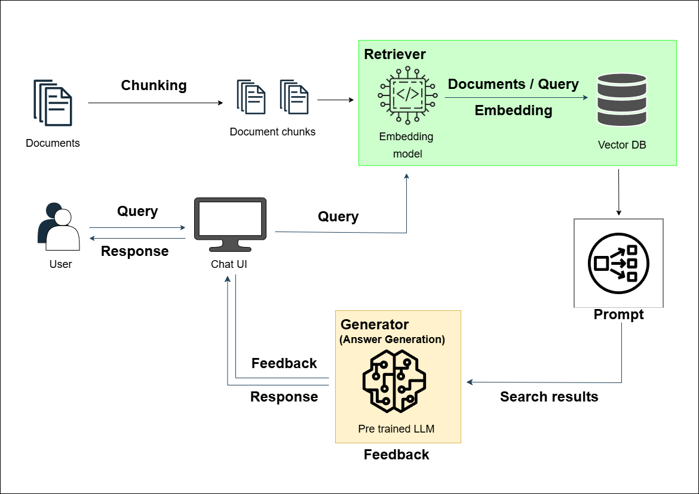

# 🧑‍⚖️ Korean Legal Chatbot using RAG (Retrieval-Augmented Generation)

이 프로젝트는 한국어 법률 데이터를 기반으로 RAG(Retrieval-Augmented Generation) 구조를 활용하여 구축한 법률 특화 챗봇 시스템입니다. 총 3종의 LLM 기반 모델을 활용하여 성능 비교 및 최적화를 수행하며, 실제 법률 QA 시스템 개발에 필요한 기술 스택을 통합적으로 구성하였습니다.

---

## 📄 개발 일정 및 이력
| 날짜 | 주요 작업 |
|------|-----------|
| 2025.05.27 | 데이터 수집 및 프로젝트 착수 |
| 2025.05.29~ | 모델 구조 구현 및 토큰 테스트 |
| 2025.06.11~ | 각 모델별 응답 비교 실험, 문서화 진행 |
| 향후 보안 | 속도 개선 및 답변 개선 등 |

---

## 📌 프로젝트 개요

| 항목 | 내용 |
|------|------|
| 프로젝트 명 | Korean Legal RAG Chatbot |
| 프로젝트 시작일 | 2025년 5월 27일 (화요일) |
| 목적 | 한국 법률 정보 기반 질의응답 제공 시스템 구현 |
| 모델 | EXAONE (생성형 LLM), KLUE-RoBERTa / KoreALBERT (추론형 모델) |
| 검색기 | KR-SBERT 기반 벡터 검색 (FAISS 등 연동 예정) |
| 데이터 출처 | AI Hub (법률 QA, 판례, 규정 문서 등) |
| 주요 기능 | 질의 기반 답변 생성, 정확한 문헌 인용, 다양한 모델 성능 비교 |
| 대상 사용자 | 일반 사용자, 법률 초심자, 기업 내부 시스템 등 |

---

## 🛠️ 기술 스택 및 구현 환경

- 운영체제 
    
     

- 언어 

    
 
- 백엔드 프레임워크

    
    
  

- 임베딩/검색기

    
  

- 프론트엔드

    

- 개발 도구

    
  

- RAG 구성요소
  - Retriever: SBERT 기반 벡터 검색  
  - Generator: 사전 학습 LLM 3종 비교 (EXAONE / KLUE-RoBERTa / KoreALBERT)

---
## 시스템 구성도 (RAG 구조)

---

## 🤖 사용 모델 소개 및 논문
### EXAONE 3.5 2.4B
- Hugging Face: https://huggingface.co/LGAI-EXAONE/EXAONE-3.5-2.4B-instruct
- 논문: https://arxiv.org/abs/2412.04862

### polyglot-ko-1.3b
- Hugging Face: https://huggingface.co/EleutherAI/polyglot-ko-1.3b


### skt/kogpt2-base-v2
- Hugging Face: https://huggingface.co/skt/kogpt2-base-v2
- 논문: https://arxiv.org/abs/2010.06090
---

## 🗃️ 활용 데이터셋 (AI Hub)
## 데이터셋 구성 및 활용 전략
- 본 프로젝트는 각기 다른 AI Hub 공개 데이터셋 3종을 활용하여, Retrieval-Augmented Generation (RAG) 기반 법률 챗봇을 설계하였습니다.
- 각 데이터셋은 챗봇 시스템의 다른 기능 모듈에 맞추어 전략적으로 분리 활용됩니다.

### 구성 전략
1. 질문-답변 형식 데이터 (AIHub 데이터셋 ①)
  → 사용자 자연어 질문에 대한 초기 응답 생성 구조 구성에 활용
  → LLM 기반 응답의 학습/튜닝 또는 예시 제공용

2. 법령/판결문/약관 텍스트 (AIHub 데이터셋 ②)
  → 정확한 조문/판결문 인용 응답을 위한 RAG Retriever 문서베이스 구성
  → 문서를 Chunking하여 긴 문맥 처리 기반의 정밀 응답 보완

3. 법률 지식 그래프용 관계 데이터 (AIHub 데이터셋 ③)
  → 내부 지식그래프 구축 또는 키워드 기반 추천 기능에 활용
  → 향후 유사 질의 추천, 질문 카테고리 자동 분류 등에 확장 가능

## 데이터셋별 전략적 활용 요약

|데이터셋 출처|역할|활용 방식|
|---|---|---|
|① 질의응답 형식 데이터|사용자 질문-응답 구조 구성|예시 기반 생성형 학습 or 평가
|② 판결/법령/약관 텍스트|근거 문서 기반 응답|문서 Chunk + RAG Retrieval
|③ 관계형 데이터 (그래프)|키워드 연관, 추천 기능|지식그래프 또는 분류 라벨링

## 데이터 출처
| 이름 | 설명 | URL |
|------|------|------|
| 법률 QA 데이터 | 질의-응답 쌍으로 구성된 지식 기반 | https://www.aihub.or.kr/aihubdata/data/view.do?dataSetSn=99 |
| 법령·판결문 텍스트 | 정확한 문서 기반 응답 생성을 위한 데이터 | https://www.aihub.or.kr/aihubdata/data/view.do?dataSetSn=580 |
| 법률 지식 그래프용 데이터 | 문서 분류 및 필터링용 관계 데이터 | https://www.aihub.or.kr/aihubdata/data/view.do?dataSetSn=71722 |

---
## 📁 데이터 폴더 구조
```
chatbot_project_data/
└── law_chatbot_dataset/
    ├── law_knowledge_base/
    │   └── 질문-답변 형식 데이터셋
    ├── law_Knowledge_Based_Relationship_Data/
    │   └── 관계 기반 지식 그래프 데이터
    └── law_Regulations_Text_Analysis_Data/
        └── 법령, 판결문, 약관 텍스트 데이터
```

## 📁 프로젝트 디렉토리 구조
```
law_chatbot/
├── app/
│ ├── backend.py ← Flask 서버
│ ├── main_ui.py ← Gradio UI 실행기
│ ├── __init__.py
│ └── utils/ ← 전처리, OCR 등 공통 함수
│     └── preprocessing.py
│     └── __init__.py
│
├── models/ ← 모델별 실행 로직 분리
│ ├── EXAONE3.5_7.8B.py
│ ├── klue_roberta_base.py
│ └── kc_electra_base_v2022.py
│
├── templates/ ← HTML 기반 UI (Flask용)
│   └── main.html
│
├── static/ ← 구조도, 출력 이미지 등 정적 파일
│   └── RAG_architecture.png
│
├── uploads/ ← 사용자 업로드 파일 저장소
│
├── data/ ← (예시 전용) 테스트용 데이터셋
│   └── sample_dataset.json ← 실제 대용량은 외장하드에 있음
│
├── transformers_modules/
│   └── EXAONE_3/
│       └──__init__.py
│       └── EXAONE-3.5-2.4B-Instruct/
│           ├── __init__.py
│           ├── configuration_exaone.py
│           └── modeling_exaone.py
│
├── faiss_db
│   └── law_index ← 법률 QA 데이터를 임베딩하여 저장한 FAISS 벡터 인덱스 디렉토리
│                   (vectorstore.save_local("faiss_db/law_index")로 생성됨)
│
├── faiss_index_store ← 예비 인덱스 저장소 (요약용/다른 주제용 등 추가 인덱스를 저장할 수 있는 폴더)
│ 
├── README.md
├── requirements.txt
└── .gitignore

```

---
## 📊 모델별 성능 비교

| 모델                     | 파라미터 수 | 응답 정확도          | 응답 속도        | 메모리 사용량 | 비고                    |
| ---------------------- | ------ | --------------- | ------------ | ------- | --------------------- |
| **EXAONE 3.5 2.4B**    | 약 2.4B | 중상 (실 사용 경험 기반) | 보통 (8bit 기준) | 중간      | 지식문 침적화, 경량 버전        |
| **polyglot-ko-1.3b**   | 약 1.3B | 중 (KoGPT2보다 나음) | 빠름           | 낮음      | 자연스러운 한국어 생성, 공개 LLM  |
| **skt/kogpt2-base-v2** | 약 125M | 중하 (경량 모델)      | 매우 빠름        | 매우 낮음   | RAG 연동 용이, 속도 최적화에 유리 |

---

## ❓LangChain 미사용 이유 vs 함수 기반 구현 선택 이유

| 항목 | LangChain 미사용 이유 | 함수 기반 선택 이유 |
|------|------------------------|----------------------|
| **1. 프로젝트 가벼움** | 많은 의존성과 설정이 필요 | 필요한 기능만 빠르게 구현 가능 |
| **2. 커스터마이징 자유도** | 추상 레이어가 많아 제어 어려움 | `prompt`, `generate()` 직접 제어 가능 |
| **3. 디버깅 편의성** | 중간 단계 로직 추적 어려움 | `print()`/`logging` 등 디버깅 용이 |
| **4. 속도 및 경량성** | 불필요한 기능 포함으로 속도 저하 가능 | 빠르고 메모리 효율적 |
| **5. Flask 통합** | 자체 Gradio/FastAPI 서버와 충돌 | Flask 구조와 완전 통합 가능 |

---

## 💬 실행 예시 (EXAONE 생성 응답 기준 예시)

**입력**  
  - 한국에서 사기죄가 성립되기 위한 요건은 무엇인가요?

**출력 (EXAONE 기반 예상 답변 / 추후 실제 답변으로 수정)** 
- 사기죄는 행위자가 타인을 기망하여 착오에 빠뜨리고, 그로 인해 재산상 이익을 취득하거나 손해를 발생시키는 경우 성립합니다. 이는 형법 제347조에 명시되어 있습니다.
---

## 🗓️ 개발 일정 및 이력
| 날짜 | 주요 작업 |
|------|-----------|
| 2025.05.27 | 데이터 수집 및 프로젝트 착수 |
| 2025.05.29~ | 모델 구조 구현 및 토큰 테스트 |
| 2025.06.11~ | 각 모델별 응답 비교 실험, 문서화 진행 |
| 보안 | FAISS 벡터 검색기 연동, UI 완성, 리포트 생성 |
---
## 📦 설치 방법 (Installation)

Python 가상환경을 설정한 후 다음 명령어를 실행하세요:

```bash
pip install -r requirements.txt
```
---
## 🔧 실행 방법

Flask 백엔드 서버를 실행하기 위해 아래 명령어를 순서대로 입력합니다:

```bash
# 현재 디렉토리를 PYTHONPATH에 추가 (모듈 import 오류 방지용)
export PYTHONPATH=.

# 백엔드 서버 실행
python app/backend.py
```
## 요약 비교
| 방식                         | 장점                    | 단점                               |
| -------------------------- | --------------------- | -------------------------------- |
| `python app/backend.py`    | 간단함                   | `PYTHONPATH` 설정 없으면 import 에러 가능 |
| `export PYTHONPATH=.` 후 실행 | 패키지 import 경로 확실히 설정됨 | 한 번 더 명령어 입력해야 함                 |
---

## 🎯 포트폴리오 활용 포인트

- 한국어 기반 RAG 구조 직접 구현 경험
- 대형 LLM + 벡터 검색기 통합 구현
- Hugging Face 기반 실전 모델 사용 및 비교 분석
- 실제 법률 QA 데이터셋을 활용한 의미 있는 실험
- 학습, 추론, 리소스 최적화 등 실무 기반 문제 해결 능력

---

## 🚀 향후 발전 방향
- 예정: 성능 비교 리포트 자동 생성 시스템 구축
- 예정: Reranker + OCR 기반 문서 필터링 정확도 향상
- 예정: 판례 요약 + 조문 연결 + 인용문 추천 기능 개발
- 예정: Gradio UI 또는 HTML 프론트엔드와의 통합

---
## ✅ 향후 개선 계획 요약

**EXAONE-2.4B 모델**
- 현재 구조는 거의 완성되었으며, 향후 가장 중요한 개선 방향은 **응답 속도 향상**입니다.
- 초기 로딩 시간(약 3분 40초)은 로컬 기반 모델의 불가피한 부분이며, 이는 배포 시 비동기화 로딩 또는 캐싱 구조로 개선할 예정입니다.

**kogpt2-base-v2 / polyglot-ko-1.3b 모델**
- 두 모델은 경량화를 위한 **후속 비교 실험 모델**로써 구축되었으며, 추후 **답변 누락 방지**와 **자동 요약 기능**을 강화할 계획입니다.

---

## 🔧 향후 보완 및 확장 계획
| 항목                     | 설명                                                                           |
| ---------------------- | ---------------------------------------------------------------------------- |
| 🚀 **응답 속도 향상**        | EXAONE 모델 응답 속도가 초기 2\~3분 소요 → GPU 환경 기준 30초 내외로 최적화 예정                      |
| 🧠 **답변 요약 기능**        | Polyglot, KoGPT2 모델에 요약 기능 추가 예정 (길게 생성된 답변 요약 후 출력)                         |
| 🧩 **LangChain 확장 계획** | 현재는 직접 구현 기반이지만, 추후 LangChain 프레임워크 기반 모듈화 및 UI 통합 예정                        |
| 🗃️ **문서 자동 인덱싱 기능**   | PDF, HWP 등 외부 문서 자동 Chunk + Vectorization 기능 도입 예정                           |
| 📊 **모델 응답 로그 저장**     | 세 모델의 응답을 비교하는 로그 또는 CSV 저장 기능 추가하여 정량적 평가 용이화                               |
| 🔍 **Reranker 추가 연동**  | 단순 cosine similarity 외에 Reranker 도입으로 검색 정확도 향상 예정                           |
| 🧩 **모델별 분리 구조 개선**    | `models/` 디렉토리 하위에 모델별 실행 로직을 분리 (예: `model_exaone.py`, `model_kogpt2.py` 등) |
| 🤖 **사용자 시나리오 정교화**    | 실제 사용 흐름 기반 시나리오 추가 (예: 일반 사용자, 기업 내부 검색용 등)                                 |

---

## ✅ 왜 전체 데이터를 사용하지 않았는가?

| 구분 | 내용 |
|------|------|
| 목적 | 실험용 챗봇 구조 안정화가 우선 |
| 선택 이유 | - 전체 데이터셋은 용량이 커 디버깅이 어려움<br>- 부분 데이터로도 RAG 흐름 구현에는 충분 |
| 향후 계획 | - 구조가 안정되면 전체 데이터 및 PDF/HWP 자동 인덱싱 기능 추가 예정 |
| 포트폴리오 측면 | - 일부 데이터로도 시스템 시연, 비교 실험, 성능 검증 가능 |

## ✅ FAISS 인덱스 개선 방법 요약
1. **최초 실행 시**: 전체 문서 벡터화 및 `saved_vectorstore`에 저장
2. **이후 실행 시**: 인덱스를 새로 생성하지 않고 불러오기만 함 → 빠른 로딩

---


